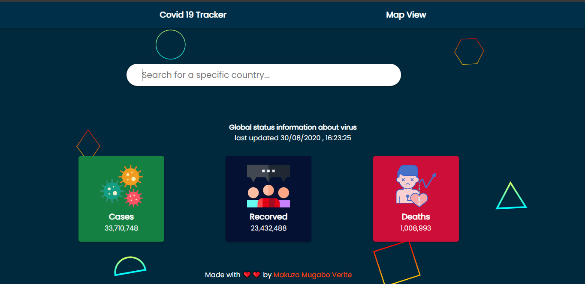
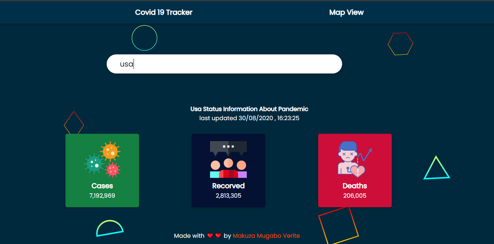
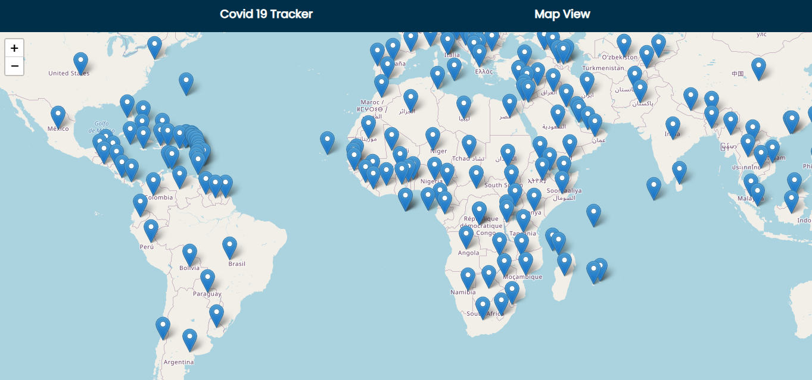

# Covid 19 Tracker Application

> Used to search for global pandemic statistics yo may also search for a perticular country and view easly how to the stuation is in particular location

### Preview image here(desktop version)






### Tech stack

- Reactjs
- css

#### How to use it on your computer

```git
  git clone https://github.com/makuzaverite/covid19tracker.git
```

```git
  cd covid19tracker
```

> in terminal do

```git
   npm install
```

```git
   npm start
```

> App should be opened in browser on post of 3000

##### Feel free to use this code in whaterver you want

###### If you wish you want to add some thing make a pull request add do it
